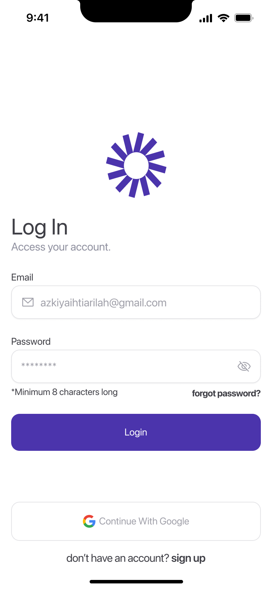
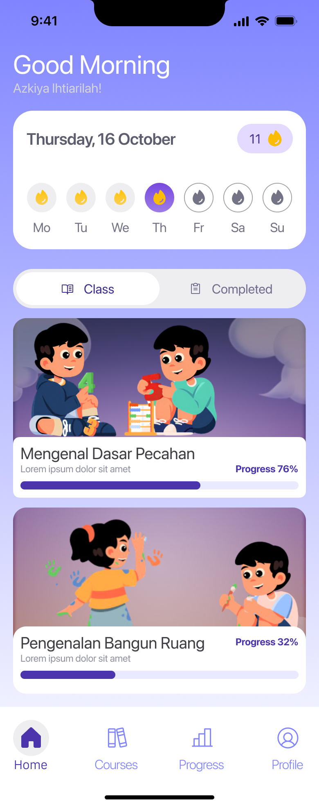
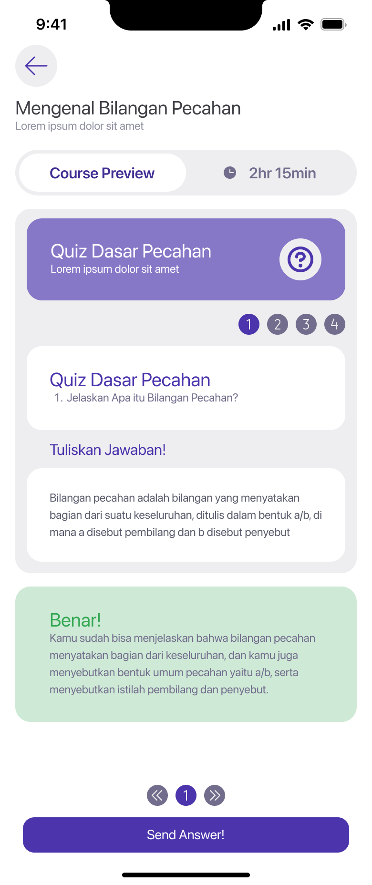

# 📱 Movato — AI-Powered Adaptive Learning App

Movato is a mobile-first learning application built to help students learn more effectively through video-based lessons, AI-graded essay assessments, and streak-based engagement mechanics.

Designed with simplicity and accessibility in mind, Movato provides a smooth learning experience powered by Flutter and connected to a RESTful Laravel backend.  
This project is currently developed as part of **PBL (Project-Based Learning)**.

---

## 🚀 Key Features

- 🎥 **Video-Based Learning** — Watch structured lessons directly in the app.  
- ✏️ **Essay Grading with AI** — Essay answers are evaluated using AI-driven scoring logic.  
- 🔥 **Streak Points System** — Gamified experience to maintain consistent learning habits.  
- 🔐 **Google OAuth** — Secure sign-in using Google accounts.  
- 📊 **Progress Tracking** — Monitor learning improvements over time.  
- 💡 **Clean & Fast UI** — Built with Flutter + Riverpod architecture.

---

## 🛠️ Tech Stack

### **Frontend (This Repository)**
- Flutter  
- Riverpod  
- Dio  
- Flutter SVG  
- Google Sign-In  
- Supabase (for some utilities & storage support)

### **Backend (Separate Repository)**
- Laravel 12
- REST API  
- PostgreSQL
- Token-based authentication  
- Google OAuth Server Exchange  

**API Base URL (Development)**  

http://127.0.0.1:8000/api/v1


---

## 📸 UI Screenshots
<table>
  <tr>
    <td></td>
    <td></td>
    <td></td>
  </tr>
</table>


---

## 📂 Project Structure
```
movato/
├── lib/
│ ├── features/
│ │ ├── auth/
│ │ ├── dashboard/
│ │ ├── courses/
│ │ ├── assessment/
│ │ └── user/
│ ├── src/
│ │ ├── core/
│ │ │ ├── widgets/
│ │ │ ├── theme/
│ │ │ ├── utils/
│ │ │ └── constants/
│ │ └── di/
│ └── main.dart
└── pubspec.yaml
```

---

## ⚙️ Installation

### **1. Clone the Repository**
```sh
git clone https://github.com/NaufalArdian12/movato.git
cd movato
```
2. Install Dependencies

flutter pub get

3. Configure Environment Variables

You will need to create a .env file based on the upcoming env.example.
Example:

API_BASE_URL=http://127.0.0.1:8000/api/v1
GOOGLE_CLIENT_ID=<your-google-client-id>

4. Run the App

flutter run

📌 Platform: Android only
📌 Backend: Laravel backend must be running in parallel
🔌 Backend Requirement

Movato requires a Laravel backend (separate repo).
Ensure the backend:

    Uses the same API base URL

    Has Google OAuth configured

    Supports /auth/oauth/google/exchange for token exchange

    Implements the same token and refresh logic

Link to backend repo will be added later.
📡 API Modules Used

    POST /auth/oauth/google/exchange — Google sign-in

    GET /user/profile — Get user data

    PUT /user/profile — Update user info

    GET /courses — Fetch course list

    POST /assessments/essay — AI essay grading

(Documentation will expand as the app grows.)
📈 Project Status

🟡 In Development
Movato is actively being built as part of the PBL program and is not yet production-ready.
🤝 Contributors

    Moch. Naufal Ardian Ramadhan — Mobile Developer / Full-Stack Developer

(Additional contributors can be added later.)
📄 License

To be added (recommended: MIT License)
